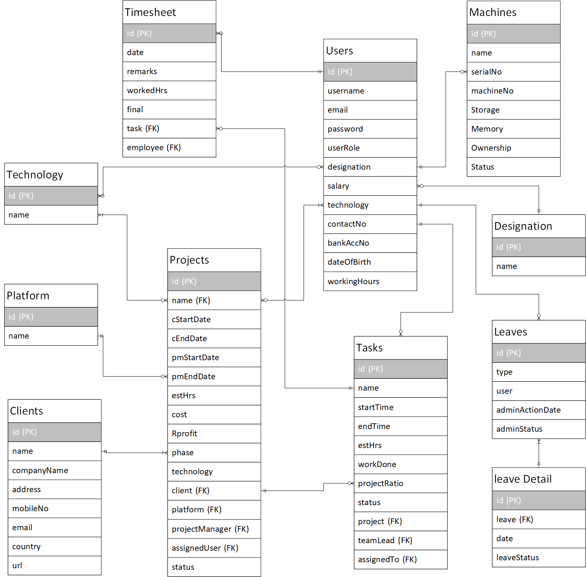

## Abstract
Car Garage is a web and mobile platform which provides an efficient way for the vehicle enthusiasts around the world for sell and purchase of the vehicles and accessories. Dealers and buyers can look for different vehicles and their parts available in their specific region and can go through and put advertisements. Car Garage provides a facility to its users by giving them option for searching for the specific vehicle by name, company and model numbers and same goes for the vehicle parts. Users can upload the pictures and specifications of their vehicles or products and posting ads which can be displayed in the car garage website and mobile application. Car Garage is a facility for users for sale and purchase of the vehicles without any dealer being involved i.e., direct dealing with the client. An exceptional feature of car garage is that it provides a price scale for a car or car parts, to the users i.e., dealers and buyers. The price scale will be a range between specific numbers according to the present market value of the vehicle or its part. This price scale will be the negotiation range for the dealer and buyer, and they must settle by staying within the given range. This will help in giving the dealer a good price for his vehicle or part and customer can also get a desirable buying price.

---
## Related Work

## Car First
CarFirst is a mobile app and website. CarFirst is remodelling the way used-cars are traded in Pakistan. Car owners can now without difficulty sell their automobiles through our secure, convenient, and simple system.

### Pak Wheels
PakWheels is a mobile app and website. PakWheels.com has helped hundreds of thousands of Pakistanis purchase & promote automobiles, examine car evaluations and news, test automobile costs and locate options to all their car needs.

### CarFinder
CarFinder is an online market for automobile that provides you pleasant offers of cars all over Pakistan. CarFinder not only gives you important points of lots of automobile for you to buy, a complete evaluation of these automobiles with every other to recognize the actual price of your dream automobile.

### AutoDeals
AutoDeals.pk is a Pakistan primarily based car platform. That affords the offerings to import dream automobiles for purchasers from U.S.A, Japan, and many other countries.

---

## DB Model

---

## Functional Requirements

**Register**
- Email and/or Phone Number, Password

**Login**
- with User Account or Google

**Post Ad**
>`requires login as user`
- Categories: `Car`, `Bike`, `Auto parts`
- ability to buy a featured ad

**Admin Panel**
>`requires login as admin`
- view all placed orders
- view analytics and reports of the system

**Add / Update Vehicle Make Types**
>`requires login as admin`
- add and update unique make types. etc `Honda`

**Add / Update Vehicle Models**
>`requires login as admin`
- add and update vehicle model and make year against a make type. etc `Civic 2010`

**Add Vehicle Body Types**
>`requires login as admin`
- add body types for different vehicles.
- unique.
- each body type associated with specific model

**Buy Auto Parts**
>`requires login as user`
- browse parts
- add to cart
- checkout with debit card

**Ads View**
>`requires login as user`
- list all adds
- searchable
- place featured ads at the top
- filter by make, model, body type, make year

**Vehicle comparison view**
>`requires login as user`
- compare 2 or 3 vehicle in a side by side card view
- compared vehicles must be in the same vehicle category

**Favorites**
>`requires login as user`
- user can view list of favorite vehicles
- can add or remove vehicles from the list

**Reviews**
>`requires login as user`
- users can review vehicles
- reviews contain a star rating out of five and description
- user can view list of reviews

**Reviews**
>`requires login as user`
- users can review vehicles
- reviews contain a star rating out of five and description
- user can view, add, remove, and update list of reviews